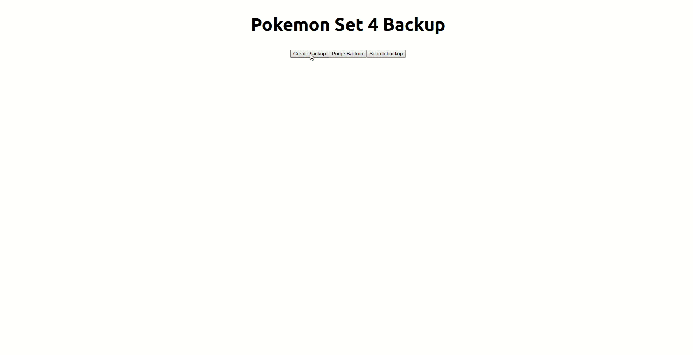

# About Pokemon-rewind

Pokemon rewind is an app that - backs up a set of card data from a set using https://docs.pokemontcg.io/ to a mongoDB database.
You are able to create/purge a backup and also query the backedup cards via HP, rarity and name. 

## How to run it

1. Install dependencies from the backend folder with `npm install` and `npm start`
2. Install dependencies for the frontend in the client folder with `npm install` and `npm start` 
3. Visit `http://localhost:3000/` or whichever host the react-app directs you to.
4. Please let me know if you have any questions!

## Assumptions
I've assumed only one backup is wanted therefore you can only create one backup at a time.
If the user inputs no queries to search for it will return the entire database.
I didn't do too much styling for the app as I didn't want to go too far over three hours.    
I left in the db data in the server.js out for public as this is just a small file - normally I'd use process.env

## Demo

## Dependencies

"@testing-library/jest-dom": "^4.2.4",  
"@testing-library/react": "^9.5.0", 
"@testing-library/user-event": "^7.2.1", 
"react": "^16.13.1", 
"react-dom": "^16.13.1", 
"react-scripts": "3.4.1" 
"body-parser": "^1.19.0", 
"express": "^4.17.1", 
"mongodb": "^3.5.9"

